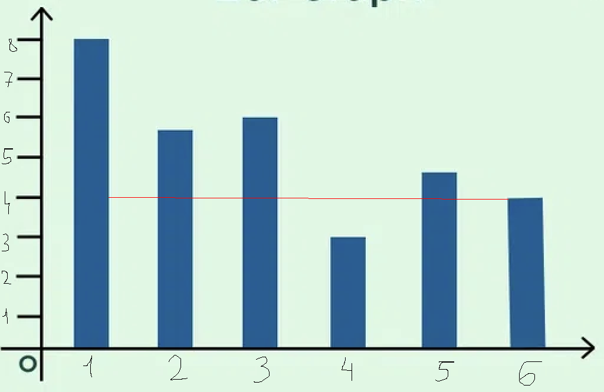

# C++ tasks

Пояснение: в директории `tasks/taskN` (где N - номер задачи) находятся все необходимые файлы. В текстовых файлах `inputK.txt` содержатся входные тестовые данные, а в `outputK.txt` - соответствующие выходные данные (ответы). Файл `taskN.cpp` трогать нельзя.

0. Графовые алгоритмы

Создать класс граф. Реализовать алгоритмы:

* поиск в глубину и ширину (+ поиск компонент связности и поиск кратчайших расстояний);
* алгоритм Дейкстры и алгоритм Флойда-Уоршелла;
* алгоритм Прима и алгоритм Крускала (Краскала).

1. Задача про максимальное значение

Даны массив вещественных чисел и 4 вида операций: +, -, *, /.
Какое максимальное значение можно получить, используя эти операции? Вычисления осуществляются последовательно (без учета приоритетности).

Примеры:

```
[1, 2, 3, 4]
1 + 2 * 3 * 4 = 36

[3, -3, 0.2, -6]
3 * (-3) / 0.2 * (-6) = 270
```

2. Решето Эратосфена

`n => {p | p - простое <= n}`

3. Решето Сундарама

`n => {p | p - простое <= n}`

4. Задача про нахождение помещения с наибольшим объемом

Имеется склад длиной `a`, шириной `b` и высотой `c`.
Необходимо найти помещение с наибольшим объемом. Это помещение формируется следующим образом.
Его ширина фиксирована и равна `b`.

Есть массив из `n` целых чисел, характеризующий высоты колонн,
которые могут быть использованы при строительстве.

Пример такого массива представлен на рисунке ниже:


Двигать колонны нельзя, а высота помещения ограничивается минимальной высотой из 2 рассматриваемых колонн, длина определяется расстоянием между колоннами.

Пусть `a = b = c = 10`. Если мы возьмем 1ую и 6ую коллонны, то объем помещения равен `10 * (6 - 1) * 6 = 300`.

5. Корректность скобочного выражения

Написать программу, определяющую корректность скобочного выражения, состоящего из скобок 4 типов: `(), [], {}, <>`. В общем случае выражение может содержать произвольные символы.

6. Вычисление арифметического выражения в форме обратной польской записи

Реализовать алгоритм вычисления арифметического выражения в форме обратной польской записи.

7. Стековый калькулятор

Написать стековый калькулятор, который вычисляет значение арифметического выражения, состоящего из констант (вещественных чисел, разделитель целой и дробной части - точка), знаков арифметических операций и круглых скобок и не содержащего переменных. На вход подается строка, представляющая собой арифметическое выражение. Его корректность не гарантируется, поэтому перед вычислением необходимо проверить его на корректность. В случае, если оно некорректно, выдать соответствующее сообщение, в противном случае - вычисленное значение. Обозначения операций: сложение/вычитание (+, -), умножение/деление (*, /), применение унарного минуса (-), возведение в степень (^). Круглые скобки используются для задания приоритета.

8. Поиск подстроки в строке. Алгоритм Кнута-Морриса-Пратта

9. Сжатие (компрессия). Алгоритм LZW


```bash
git remote add REMOTE_NAME REMOTE_REPO_URL_1
git remote set-url --add --push REMOTE_NAME REMOTE_REPO_URL_1
git remote set-url --add --push REMOTE_NAME REMOTE_REPO_URL_2
...
git remote set-url --add --push REMOTE_NAME REMOTE_REPO_URL_N

or

git remote add REMOTE_NAME REMOTE_REPO_URL_1
for (( i=1; i<=N; i++ ))
do
  git remote set-url --add --push REMOTE_NAME REMOTE_REPO_URL_I
done
```
